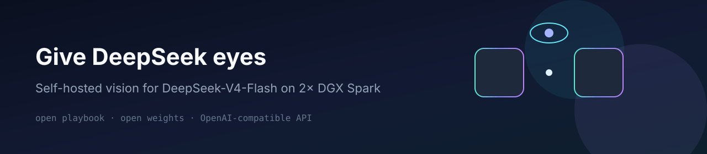
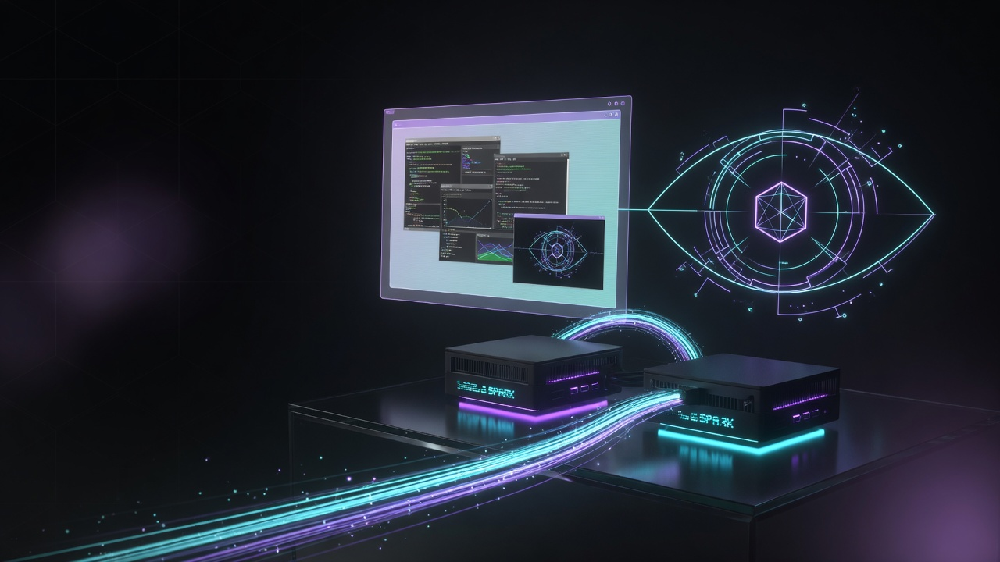

<p align="center">
  
</p>

<p align="center">
  <strong>Screenshots in. Answers out. On your own hardware.</strong><br/>
  Vision for <a href="https://huggingface.co/deepseek-ai/DeepSeek-V4-Flash-0731">DeepSeek-V4-Flash-0731</a>
  on <strong>2× NVIDIA DGX Spark</strong> — open playbook, open encoder weights.
</p>

<p align="center">
  <a href="https://github.com/FlyCockpit/DeepSeek-V4-Vision-2x-DGX-Sparks/blob/main/LICENSE"></a>
  <a href="https://huggingface.co/FlyCockpit/DeepSeek-V4-Flash-0731-vision"></a>
  <a href="#quick-start"></a>
  <a href="#quick-start"></a>
</p>

<p align="center">
  
</p>

---

## What you get

| | |
|---|---|
| **Model** | DeepSeek-V4-Flash-0731 + FlyCockpit vision encoder |
| **Hardware** | 2× DGX Spark (tensor parallel) |
| **API** | OpenAI-compatible `http://<head>:8899/v1` |
| **Weights** | [FlyCockpit/DeepSeek-V4-Flash-0731-vision](https://huggingface.co/FlyCockpit/DeepSeek-V4-Flash-0731-vision) |
| **Cold start** | ~6 minutes (loads the full FP8 backbone once) |

Point any OpenAI-compatible client (curl, Open WebUI, your agent stack) at the
head node. Send images as `image_url` content parts. Get text back.

```bash
curl http://HEAD:8899/v1/chat/completions \
  -H "Content-Type: application/json" \
  -d '{
    "model": "deepseek-v4-flash-0731-vision",
    "messages": [{
      "role": "user",
      "content": [
        {"type": "text", "text": "What is on this screen?"},
        {"type": "image_url", "image_url": {"url": "data:image/png;base64,..."}}
      ]
    }],
    "max_tokens": 128
  }'
```

---

## Quick start

**You need:** two DGX Sparks on a fast fabric (RoCE / 200G-class), Docker with
NVIDIA runtime, and ~200 GB free disk per node.

```bash
# on both nodes
git clone https://github.com/FlyCockpit/DeepSeek-V4-Vision-2x-DGX-Sparks.git
cd DeepSeek-V4-Vision-2x-DGX-Sparks
cp .env.vision.example .env.vision
# edit fabric IPs + paths (see comments in the file)

bash scripts/download-assets.sh   # backbone + vision encoder (md5-checked)
bash scripts/build-image.sh
```

```bash
# on the HEAD only
bash scripts/start-vision.sh      # starts worker first, then head
bash scripts/smoke-vision.sh      # text check
bash scripts/smoke-vision.sh photo.png   # image check
```

That’s it. Status / stop:

```bash
bash scripts/status-vision.sh
bash scripts/stop-vision.sh
```

<details>
<summary><strong>What gets downloaded?</strong></summary>

1. **Backbone** — `deepseek-ai/DeepSeek-V4-Flash-0731` (FP8, ~167 GB)  
2. **Vision encoder** — from
   [`FlyCockpit/DeepSeek-V4-Flash-0731-vision`](https://huggingface.co/FlyCockpit/DeepSeek-V4-Flash-0731-vision)
   - tower (~865 MB)
   - final adapter, step **4800** (~40 MB, md5 `d9b3b3bd…`)

Checksums are verified on download. Always verify on **both** nodes before serving.

</details>

<details>
<summary><strong>Environment cheat sheet</strong></summary>

| Variable | Meaning |
|---|---|
| `HEAD_FABRIC_IP` / `WORKER_FABRIC_IP` | RoCE data-plane IPs |
| `MASTER_ADDR` | Usually the head fabric IP |
| `NCCL_IB_HCA` / `NCCL_SOCKET_IFNAME` | From `ibdev2netdev` on your boxes |
| `TOWER_DIR` / `CKPT_DIR` | Host folders with tower + adapter |
| `PLUGIN_DIR` | This repo’s `plugin/` directory |

If the two machines use different usernames, set `WORKER_*` path overrides in
`.env.vision` (documented in the example file).

</details>

---

## What it’s good at

| Task | Expectation |
|---|---|
| Describe screenshots & UIs | Strong |
| Read layout / on-screen text | Strong |
| Everyday photos | Decent |
| Click-agent / real-world computer-use | **Not production-ready yet** |

We measured coordinate grounding on synthetic GUIs (works) and on real web
pages (does not transfer cleanly). Details:
[`docs/CAPABILITIES.md`](docs/CAPABILITIES.md).

---

## Why two Sparks?

The official FP8 checkpoint is ~167 GB. A single Spark’s memory can’t host it
for this full-precision path. Tensor-parallel across two nodes is the supported
recipe.

Want **text-only on one box** with a small quant? See the optional Antirez
path below — different engine, no vision.

<details>
<summary><strong>Optional: 1× Spark, 2-bit text-only (Antirez)</strong></summary>

Not part of the vision stack. For fast **text** on a single Spark:

- Engine: [`antirez/ds4`](https://github.com/antirez/ds4) (CUDA)
- Quant: [`antirez/deepseek-v4-gguf`](https://huggingface.co/antirez/deepseek-v4-gguf) q2-imatrix (~81 GB)

```bash
git clone https://github.com/antirez/ds4.git && cd ds4
# build CUDA backend per ds4 README / QA notes for DGX Spark
./download_model.sh q2-imatrix
./ds4 -m ds4flash.gguf --ctx 8192 --nothink -p "Reply with exactly: OK"
```

This path has **no vision encoder**. Tensor-parallel in ds4 is Metal-only
(Apple), not Spark CUDA.

</details>

---

## Repo map

```text
├── assets/                 # banner + hero
├── plugin/                 # vLLM vision plugin (bind-mounted, editable)
├── scripts/
│   ├── download-assets.sh
│   ├── build-image.sh
│   ├── preflight-adapter.sh
│   ├── start-vision.sh     # worker first, then head
│   ├── smoke-vision.sh
│   ├── status-vision.sh
│   └── stop-vision.sh
├── docker-compose.vision.yml
├── Dockerfile
├── docs/                   # network, capabilities, troubleshooting
└── .env.vision.example
```

---

## Docs

| Doc | When you need it |
|---|---|
| [`docs/NETWORK.md`](docs/NETWORK.md) | Fabric, NCCL, ports |
| [`docs/CAPABILITIES.md`](docs/CAPABILITIES.md) | What works / what doesn’t |
| [`docs/TROUBLESHOOTING.md`](docs/TROUBLESHOOTING.md) | Silent layout bugs, OOM, hangs |
| [`CREDITS.md`](CREDITS.md) | Upstream lineage |

---

## Compatibility

Works with **`deepseek-ai/DeepSeek-V4-Flash-0731` only.**  
Preview / DSpark / third-party NVFP4 of the *old* line will load but produce
garbage relative to this encoder — different embedding space.

---

## Links

| | |
|---|---|
| **Playbook** | https://github.com/FlyCockpit/DeepSeek-V4-Vision-2x-DGX-Sparks |
| **Vision weights** | https://huggingface.co/FlyCockpit/DeepSeek-V4-Flash-0731-vision |
| **Backbone** | https://huggingface.co/deepseek-ai/DeepSeek-V4-Flash-0731 |

---

<p align="center">
  <sub>Built by <a href="https://github.com/FlyCockpit">FlyCockpit</a> · MIT playbook · weights Apache-2.0 (adapter packaging)</sub>
</p>
